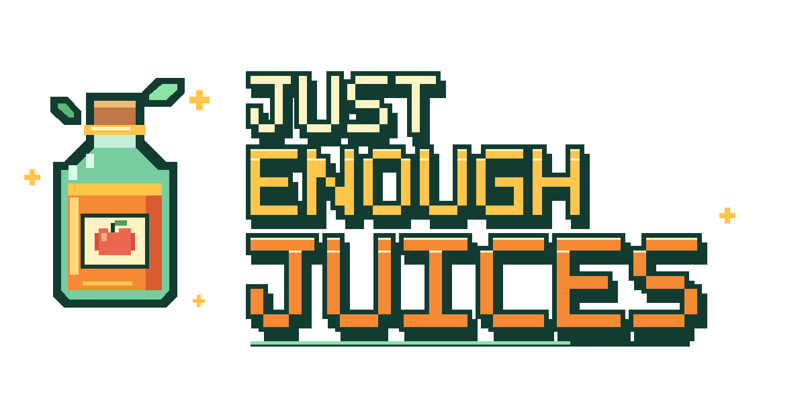
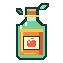

# Just Enough Juices



*Juice it. Sip it. Feel fine.*

A Forge mod for **Minecraft 1.18.2** that turns fruit, vegetables and a few stranger
ingredients into a full line of **juices** — each one handing you a set of custom
powers, with **boosted** versions that push them further.

[](art/logo/just-enough-juices-bottle-512.png)

---

## What's in the glass?

- **20 juices**, each with a normal and a **boosted** version (40 items).
- **Custom power system** — juices grant the mod's own effects, not vanilla potion
  effects. Hover any bottle in-game to see what it does.
- **Juice Making Table** — a machine that juices ingredients for you.
- **Four wild berry bushes** that grow around the world.
- **Fruit powers** — Orchard Guard, Frostbite, Solar Charge and Forager's Luck.
- **Emerald Dust**, villager trades, advancements, composting and more.

---

## Installation

1. Install Minecraft **1.18.2** with **Minecraft Forge 40.1.0 or newer**.
2. Drop the mod `.jar` into your `mods/` folder.
3. Launch the game and enjoy.

Requires **Java 17**.

---

## Making Juice

### Crafting table

Every juice follows one of two simple vertical recipes.

**Juice** — one fruit over a milk bucket over a glass bottle:

```
 F     F = fruit / ingredient
 M     M = Milk Bucket
 G     G = Glass Bottle  ->  Juice
```

**Boosted Juice** — the base juice boosted with emerald dust:

```
 M     M = Milk Bucket
 E     E = Emerald Dust
 J     J = base Juice    ->  Boosted Juice
```

> `Glass Bottle` is the mod's own item (glass + gold nuggets). `Emerald Dust` is
> crafted from an emerald (1 emerald → 9 dust, and 9 dust → 1 emerald).

### Juice Making Table

Craft the table and stock its slots:

| Slot | Accepts | Role |
|------|---------|------|
| 0 | fruit / base juice | main ingredient |
| 1 | milk bucket | milk |
| 2 | glass bottle **or** emerald dust | bottle (normal) / booster (boosted) |
| 3 | — | finished juice output |
| 4 | — | returned empty buckets |

It matches the same recipes as the crafting table, takes **5 seconds** per bottle,
and works with hoppers (input from the top/sides, output from the bottom). Put
**emerald dust** in slot 2 to make the boosted version.

---

## The Juices

Durations and amplifier levels are shown in-game on each bottle's tooltip. Effects
marked with a roman numeral are stronger on the boosted bottle.

### Fruit & vegetable juices

| Juice (base ingredient) | Powers |
|-------------------------|--------|
| **Apple** *(Apple)* | Night Vision · boosted adds Regeneration |
| **Potato** *(Baked Potato)* | Night Vision + Haste · boosted adds stronger Haste |
| **Carrot** *(Carrot)* | Strength · boosted adds Resistance |
| **Melon** *(Melon Slice)* | Jump Boost · boosted adds stronger Jump Boost |
| **Pumpkin** *(Pumpkin)* | Invisibility · boosted lasts longer |
| **Sweet Berry** *(Sweet Berries)* | Speed · boosted adds stronger Speed |
| **Wild Berry** *(Wild Berry)* | Absorption · boosted adds Strength |
| **Ice Berry** *(Ice Berry)* | Icy Foot · boosted adds Water Breathing |
| **Sun Berry** *(Sun Berry)* | Caffeinated + Speed · boosted adds Jump Boost |
| **Beetroot** *(Beetroot)* | Saturation · boosted adds Resistance |
| **Cocoa** *(Cocoa Beans)* | Haste · boosted adds Night Vision |
| **Nether Wart** *(Nether Wart)* | Fire Resistance · boosted adds Strength |
| **Spicy** *(Cactus)* | Spicy aura + Fire Resistance · boosted adds Strength |
| **Dried Kelp** *(Dried Kelp)* | Dolphin's Grace · boosted adds Water Breathing |
| **Chorus** *(Chorus Fruit)* | Levitation + Slow Falling · boosted adds stronger Slow Falling |
| **Glow Berry** *(Glow Berry)* | Glowing + Night Vision · boosted adds Float |
| **Golem** *(Iron Ingot)* | Absorption + Resistance + Slowness · boosted is stronger |

### Treasure juices

| Juice (base ingredient) | Powers |
|-------------------------|--------|
| **Glistering Melon** *(Glistering Melon Slice)* | Regeneration + Slow Falling + Speed · boosted adds Saturation |
| **Golden Apple** *(Golden Apple)* | Absorption + Fire Resistance + Night Vision · boosted adds Regeneration + Resistance |
| **Golden Carrot** *(Golden Carrot)* | Night Vision + Water Breathing + Dolphin's Grace · boosted adds Luck |

> The **Golem** line is intentionally heavy — it grants a lot of Absorption and
> Resistance at the cost of Slowness.

---

## Fruit Powers

These four powers are central to the mod and support the berry bushes. They scale
with the boosted bottles.

| Power | Found on | What it does |
|-------|----------|--------------|
| **Orchard Guard** | Apple | Reduces incoming damage by 15–40% (void damage is not reduced). |
| **Frostbite** | Ice Berry | When hit, chills the attacker — Slowness plus freezing. |
| **Solar Charge** | Sun Berry | In daylight under open sky, regenerates 1–1.5 HP every 2 seconds. |
| **Forager's Luck** | Wild Berry | Harvest 1–2 extra berries from the mod's bushes. |

## Custom effects

The mod's own effects, applied by its juices:

| Effect | What it does |
|--------|--------------|
| **Icy Foot** | Freezes the water under your feet into frosted ice, like Frost Walker. |
| **Caffeinated** | Speed and Haste while active; when the juice ends it leaves a short **Caffeine Crash** (Slowness + Mining Fatigue). |
| **Spicy** | Sets nearby mobs on fire (15% chance per second) and constantly extinguishes you. |
| **Float** | Lifts you gently into the air and slows your fall. |
| **Magnet** | (Unused) pulls nearby items and XP toward you. |
| **Caffeine Crash** | The crash after Caffeinated: slower movement and mining. |
| **Chilled** | The slow applied to mobs that hit a Frostbite user. |

---

## Berry Bushes

Four bushes generate naturally in the world. Each grows in three stages (bonemeal
works) and can be harvested once ripe; harvesting resets them to regrow.

| Bush | Drops |
|------|-------|
| **Ice Berry Bush** | Ice Berry |
| **Wild Berry Bush** | Wild Berry |
| **Sun Berry Bush** | Sun Berry |
| **Glow Berry Bush** | Glow Berry |

Berries can be eaten, juiced, composted, and pressed into their juice. **Forager's
Luck** increases the harvest.

---

## Items

- **Glass Bottle** — the container for every juice (glass + gold nuggets).
- **Emerald Dust** — the booster ingredient.
- **Juice Making Table** — the juicing machine.

---

## Trades, compost & advancements

- Farmer, cleric and wandering traders can sell juices (can be disabled).
- Berries can be composted (chance and toggle are configurable).
- Three advancements: **First Juice**, **Juice Connoisseur**, **Golden Mastery**.

---

## Overdrink

Drinking too many juices in a short window gives you a penalty so juice isn't a
free spam. By default, after **4 drinks within 10 seconds** you get Nausea and
Hunger. Everything (toggle, drink count, window, duration) is configurable.

---

## Configuration

Options live in `config/jej-common.toml`:

| Key | Default | Description |
|-----|---------|-------------|
| `general.enableVillagerTrades` | `true` | Add juices to villager trades. |
| `general.enableComposting` | `true` | Allow berries in a composter. |
| `general.compostChance` | `0.3` | Composter fill chance for berries. |
| `general.returnGlassBottle` | `true` | Return an empty bottle after drinking. |
| `overdrink.enabled` | `true` | Enable the overdrink penalty. |
| `overdrink.maxDrinks` | `4` | Drinks allowed within the window. |
| `overdrink.windowTicks` | `200` | Time window (ticks) for counting drinks. |
| `overdrink.nauseaTicks` | `200` | Nausea duration. |
| `overdrink.hungerTicks` | `300` | Hunger duration. |
| `effects.durationMultiplier` | `1.0` | Scales every juice effect's duration. |

---

## Building from source

```bash
./gradlew build             # compile + package the mod
./gradlew runClient         # launch a dev client
./gradlew runData           # regenerate assets/data (lang, models, recipes)
./gradlew runGameTestServer # run the mod's game tests
```

The project targets Java 17 and uses ForgeGradle with official Mojang mappings.

---

## Branding

The logo, icon and bottle art live in [`art/logo/`](art/logo/) with editable SVGs.
The mod's `logo.png` is generated from the bottle icon. See
[`art/logo/README.md`](art/logo/README.md) for details and regeneration
instructions.

---

## Credits

Made by **Cheese Ez**. Thanks for downloading Just Enough Juices! :D
